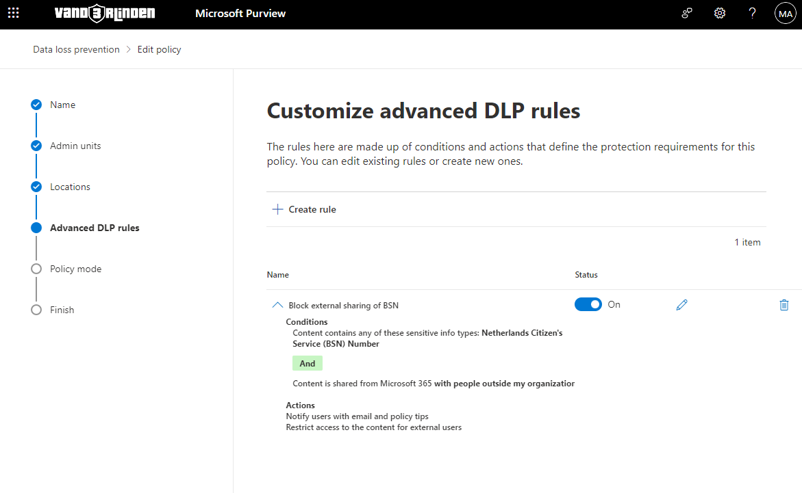
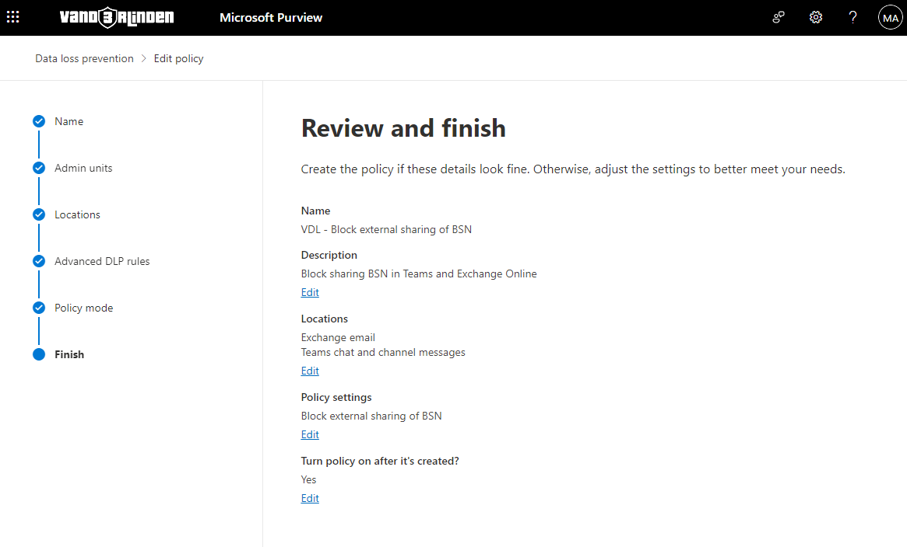
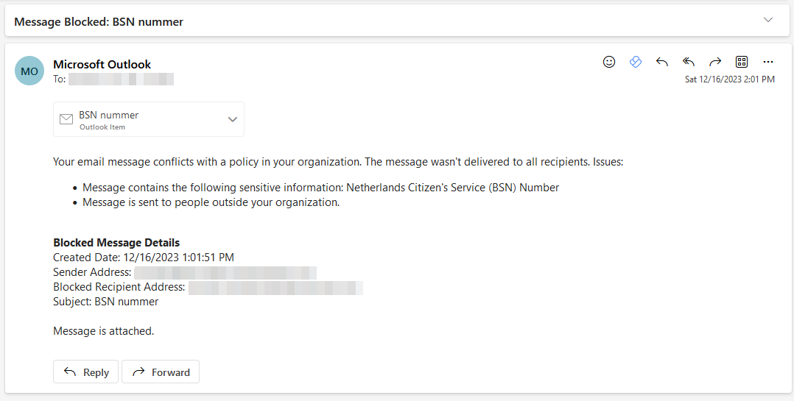
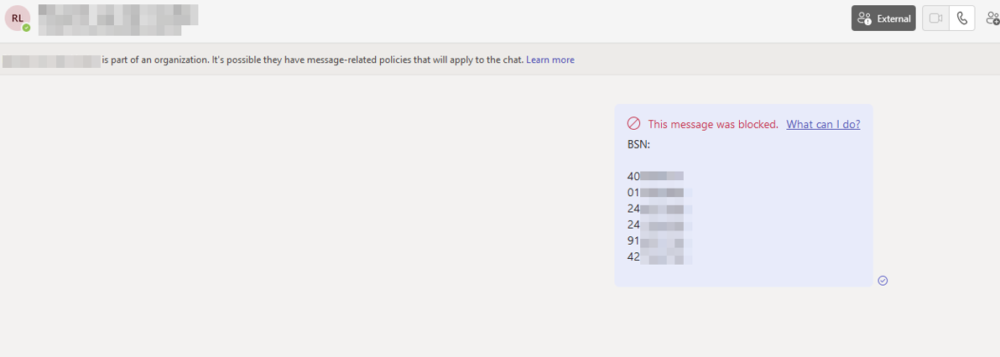

# Block emails and team messages with Netherlands Citizen’s Service (BSN) Number
1. Sign in to the [Microsoft Purview compliance portal](https://compliance.microsoft.com/)

2. In the Microsoft Purview compliance portal > left navigation > Solutions > Data loss prevention > Policies > + Create policy.

3. Select Custom from the Categories list.

4. Select Custom from the Regulations list.

5. Give the policy a name (policy name cannot be changed later).

6. Fill in a description. You can use the policy intent statement here.

7. Select Next.

8. Select Full directory under Admin units.

9. Set the Exchange email (Scope: All groups) and Teams chat and channel messages (Scope: All users & groups) locations status to On. Set all the other location status to Off.

10. Select Next.

11. Select Create rule. Name the rule and provide a description.

12. Under Conditions select Add condition > Content contains > Add > Sensitive info types > Netherlands Citizen’s Service (BSN) Number. Choose Add.

13. Under Actions select Add an action > Restrict access or encrypt the content in Microsoft 365 locations > Block only people outside your organization.

14. Set User notifications to On.

15. Select > Notify the user who sent, shared, or last modified the content.

16. Under Incident reports, select whether you want to send a report to your (compliance) admins when the policy is violated.

17. Select Save and you will be presented with a review of the rule.
    

18. Select Next.

19. Test or save your policy, it can take up to an hour for the policy to take effect.

20. Review and finish your DLP policy
    

## Examples
- Exchange Online
    
- Teams
    

## Reference
- [All Sensitive information type entity definitions](https://learn.microsoft.com/en-us/purview/sensitive-information-type-entity-definitions)
- [More DLP scenarios](https://learn.microsoft.com/en-us/purview/dlp-create-deploy-policy)
- [Blog]()